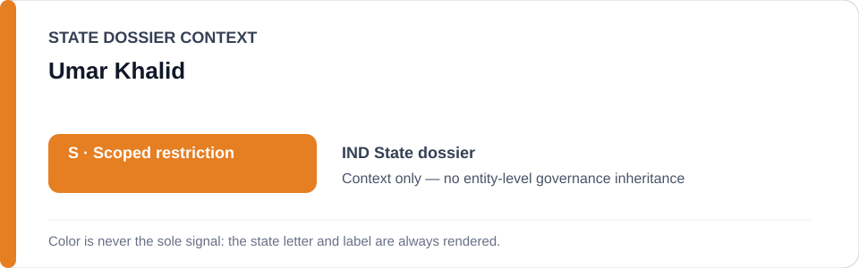
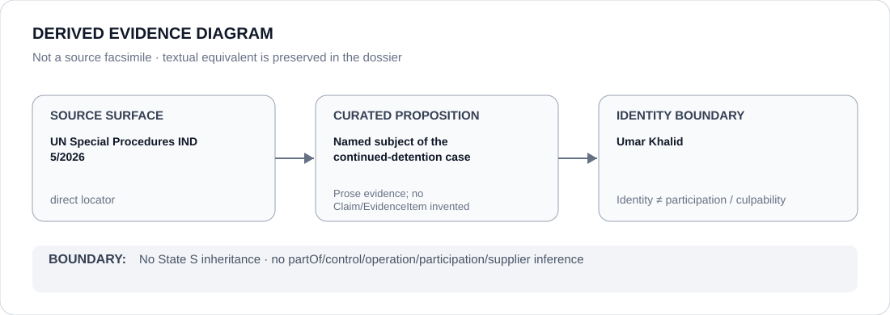

# Umar Khalid

> **Canonical per-entity evidence/provenance record.** This dossier has no licensing effect by itself and carries no standalone `provisional_outcome`.

## Identity scope

Umar Khalid, represented here solely as the named individual whose continued detention is the subject of UN Special Procedures communication `IND 5/2026` and the correspondingly bounded ECL case-project identity. Identity is not a governance or culpability finding about the person.

## State governance context

The canonical `IND` State dossier currently records **S — Scoped restriction** for specified Union/state coercive projects. That status is shown below as **context only** and is not inherited by Umar Khalid.

## Evidence record

- The India dossier preserves UN Special Procedures communication `IND 5/2026` as a direct source concerning prolonged detention.
- The later Schedule freeze identifies the exact **IND 5/2026 — Umar Khalid continued detention project**, including materially participating prosecution/custody processes, while the underlying ECL finding remains applicable.
- The freeze expressly excludes UAPA/counterterrorism enforcement generally, Indian courts/remedial activity generally and other detainees/cases absent separate evidence.

## Attribution and exclusions

Being the named subject of a detention case does not make Umar Khalid a participant in, controller of, supplier to or culpable actor for the coercive project. This dossier creates no adverse finding, no relation edge and no standalone `S` status for the person.

## Visual evidence

The diagram links the direct `IND 5/2026` source surface to the limited proposition that Umar Khalid is the named subject of the continued-detention case, then stops at the person-identity boundary.

## Evidence gaps

This dossier does not reproduce the full factual record of `IND 5/2026`, adjudicate the underlying criminal allegations, or encode individual case facts as new structured Claims/EvidenceItems. Those questions are outside this identity dossier.

## Sources

- [UN Special Procedures — IND 5/2026](https://spcommreports.ohchr.org/TmSearch/RelCom?code=IND+5%2F2026)
- [Canonical India State dossier](../states/IND.md)
- [IND named-case Schedule freeze](../../registry/schedule-state-s-freezes/batch-10a-ind-freeze.yml)

## Governance boundary

A person named as the subject of a coercive project does not inherit State governance, project responsibility, participation, culpability or Material Participation. The orange `S` is State context only.
