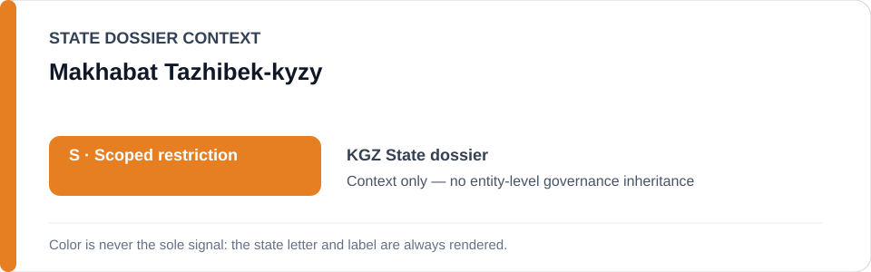
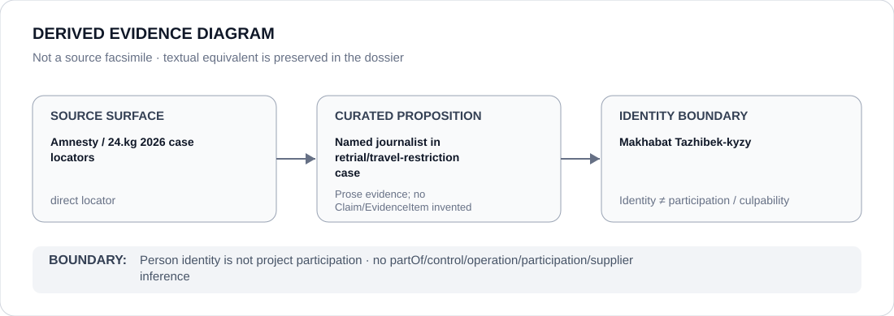

# Makhabat Tazhibek-kyzy

> **Canonical per-entity evidence/provenance record.** This dossier has no licensing effect by itself and carries no standalone `provisional_outcome`.

## Identity scope

Makhabat Tazhibek-kyzy, represented solely as the journalist named in the continuing 2026 retrial/travel-restriction case. Identity does not establish culpability, participation or a governance outcome.

## State governance context

The canonical `KGZ` State dossier records **S — Scoped restriction** for defined political-detention, media/civic-control and related coercive projects. That `S` is context only and is not inherited by Makhabat Tazhibek-kyzy.

## Evidence record

- The Kyrgyzstan dossier identifies the continuing 2026 litigation concerning Makhabat Tazhibek-kyzy after the UN Working Group on Arbitrary Detention found her detention arbitrary.
- The dossier preserves exact March 2026 Amnesty and 24.kg locators for the named retrial/travel-restriction project.
- Those locators establish the case boundary; they do not prove the dossier's separate broader torture, media-regulation, civic-space or religious-enforcement propositions.

## Attribution and exclusions

Being the journalist whose conviction/retrial/travel restrictions are under review does not make her a participant in the prosecution project. Courts, prosecutors and other actors require separate attribution evidence; no relation edge is inferred from the person's presence in the case.

## Visual evidence

The diagram links the direct case locators to the limited proposition that she is the named journalist in the proceeding, then stops at the person boundary.

## Evidence gaps

This dossier does not adjudicate the underlying criminal allegations, reconstruct the full procedural history or convert the broader Kyrgyzstan governance record into person-level Claims/EvidenceItems.

## Sources

- [Amnesty — March 2026 Tazhibek-kyzy case update](https://www.amnesty.org/en/latest/news/2026/03/kyrgyzstan-authorities-must-drop-trumped-up-charges-against-makhabat-tazhibek-kyzy-following-her-release-from-prison/)
- [24.kg — Bishkek City Court case update](https://24.kg/english/376334_Bishkek_City_Court_refuses_to_dismiss_Makhabat_Tazhibek_kyzys_criminal_case/)
- [Canonical Kyrgyzstan State dossier](../states/KGZ.md)

## Governance boundary

A journalist named as the subject of prosecution does not inherit State governance, project responsibility, participation, culpability or Material Participation. The orange `S` is State context only.
