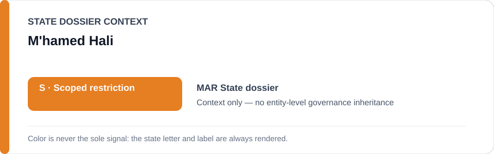
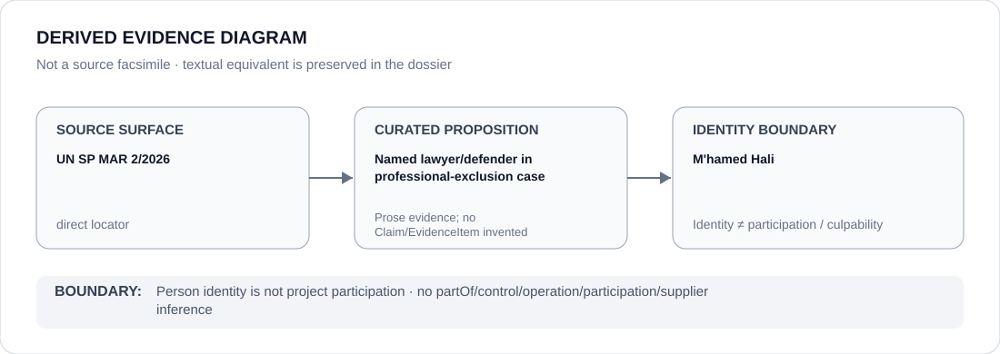

# M'hamed Hali

> **Canonical per-entity evidence/provenance record.** This dossier has no licensing effect by itself and carries no standalone `provisional_outcome`.

## Identity scope

M'hamed Hali, represented solely as the lawyer/human-rights defender named in `MAR 2/2026` and the associated professional-exclusion project. Identity does not encode culpability, a governance outcome or participation in the exclusion process.

## State governance context

The canonical `MAR` State dossier records **S — Scoped restriction** for police, intelligence, prosecutorial, judicial and digital-surveillance systems materially used against peaceful dissent and Sahrawi human-rights activity. That `S` is context only and is not inherited by M'hamed Hali.

## Evidence record

- UN Special Procedures communication `MAR 2/2026` concerns alleged retaliation and professional exclusion of Hali over views supporting Western Saharan self-determination.
- The Schedule freeze defines the exact **M'hamed Hali professional-exclusion project — MAR 2/2026**, limited to the continuing bar-admission/exclusion process where materially maintained as retaliation for protected expression/self-determination advocacy.
- Moroccan courts, bar associations, intelligence and the legal profession generally, draft legislation and independent remediation are expressly excluded.

## Attribution and exclusions

Being the lawyer/defender subjected to alleged professional exclusion does not make Hali a participant in, operator of or culpable actor for that process. The dossier does not adjudicate the underlying institutional decisions beyond the frozen proposition.

## Visual evidence

The diagram preserves the direct `MAR 2/2026` provenance and stops at the person-identity boundary.

## Evidence gaps

This dossier does not reconstruct every bar-admission or judicial step, determine the intent of each participating actor or generalize the named case to Morocco's broader Sahrawi surveillance/policing/prosecution record.

## Sources

- [UN Special Procedures — MAR 2/2026](https://spcommreports.ohchr.org/TmSearch/RelCom?code=MAR+2%2F2026)
- [MAR named-case Schedule freeze](../../registry/schedule-state-s-freezes/batch-11b-mar-freeze.yml)
- [Canonical Morocco State dossier](../states/MAR.md)

## Governance boundary

A lawyer/defender named as the subject of professional exclusion does not inherit State governance, project responsibility, participation, culpability or Material Participation. The orange `S` is State context only.
