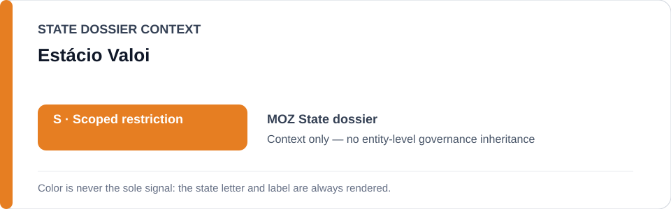
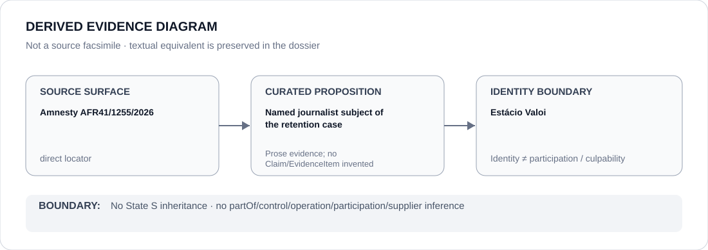

# Estácio Valoi

> **Canonical per-entity evidence/provenance record.** This dossier has no licensing effect by itself and carries no standalone `provisional_outcome`.

## Identity scope

Investigative journalist Estácio Valoi, represented solely as the named person whose work equipment is the subject of the Pemba search/seizure and retention project preserved in the Mozambique Schedule-freeze provenance.

## State governance context

The canonical `MOZ` State dossier currently records **S — Scoped restriction** for specifically attributable police/public-order/security repression projects. That status is shown below as **context only** and is not inherited by Estácio Valoi.

## Evidence record

- `batch-11c-moz-freeze.yml` identifies the 16 June 2026 search/seizure and continued retention of Valoi's work equipment in Pemba, documented by Amnesty International on 3 July 2026.
- The freeze is limited to that named seizure/retention process while the equipment remains retained without an independently demonstrated lawful, necessary and proportionate basis.
- The freeze expressly excludes SERNIC or Mozambican policing generally and terminates its defined boundary after return of the equipment or independent judicial validation/remedy.

## Attribution and exclusions

Valoi is the subject of the documented project, not a State actor or participant in the coercive conduct described by the freeze. This dossier creates no adverse finding, no State-governance inheritance and no Material Participation claim about him.

## Visual evidence

The diagram uses the direct Amnesty source locator only to establish the named case-subject identity and preserves the person/project boundary.

## Evidence gaps

This dossier does not independently determine the current physical status of every item of equipment after the evidence cutoff, adjudicate the legality of the seizure, or invent structured Claims beyond the curated freeze/dossier record.

## Sources

- [Amnesty International — AFR 41/1255/2026](https://www.amnesty.org/en/documents/afr41/1255/2026/en/)
- [Canonical Mozambique State dossier](../states/MOZ.md)
- [Mozambique named-project Schedule freeze](../../registry/schedule-state-s-freezes/batch-11c-moz-freeze.yml)

## Governance boundary

A journalist named as the subject of a coercive project does not inherit State governance, project responsibility, participation, culpability or Material Participation. The orange `S` is State context only.
