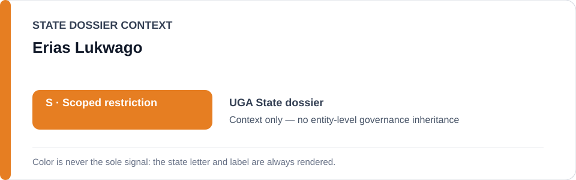
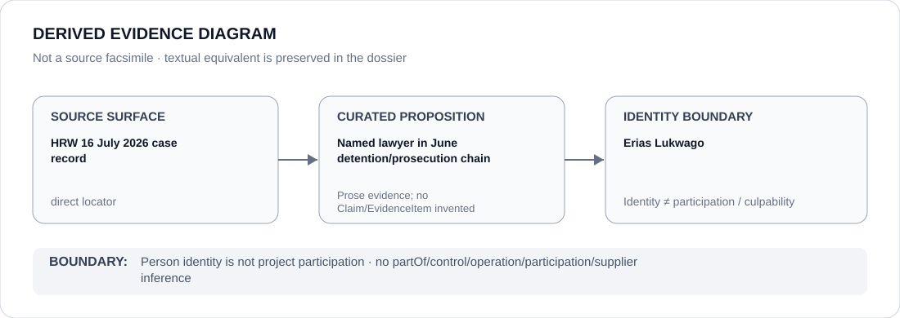

# Erias Lukwago

> **Canonical per-entity evidence/provenance record.** This dossier has no licensing effect by itself and carries no standalone `provisional_outcome`.

## Identity scope

Erias Lukwago, represented solely as the lawyer named as the subject of the 15–22 June 2026 detention/prosecution chain frozen in the Uganda record. This dossier makes no culpability or participation finding about him.

## State governance context

The canonical `UGA` State dossier records **S — Scoped restriction** for defined military/intelligence/police and political-control projects. That `S` is context only and is not inherited by Erias Lukwago.

## Evidence record

- The Uganda freeze identifies the exact **Erias Lukwago June 2026 detention and prosecution project**.
- Its project boundary is the 15–22 June military seizure, incommunicado holding, transfer to police/court process and associated prosecution concerning Lukwago.
- Human Rights Watch is retained as the direct identity/case locator; the freeze expressly excludes UPDF, police and Ugandan courts generally, independent legal/remedial activity and unrelated critic/media cases.

## Attribution and exclusions

Being the lawyer subjected to detention/prosecution does not make Erias Lukwago an operator, participant or culpable actor in that chain. Institutional participation must be evidenced separately and cannot be inferred from the person's case identity.

## Visual evidence

The diagram identifies him as the named lawyer in the bounded case and terminates at the person-identity boundary.

## Evidence gaps

This identity dossier does not adjudicate the prosecution, reconstruct every custody transfer or assign responsibility to any military, police, prosecutorial or judicial actor absent separate structured evidence.

## Sources

- [Human Rights Watch — Uganda military seizing government critics](https://www.hrw.org/news/2026/07/16/uganda-military-seizing-government-critics)
- [UGA named-case Schedule freeze](../../registry/schedule-state-s-freezes/batch-13b-uga-freeze.yml)
- [Canonical Uganda State dossier](../states/UGA.md)

## Governance boundary

A lawyer named as the subject of a coercive project does not inherit State governance, project responsibility, participation, culpability or Material Participation. The orange `S` is State context only.
