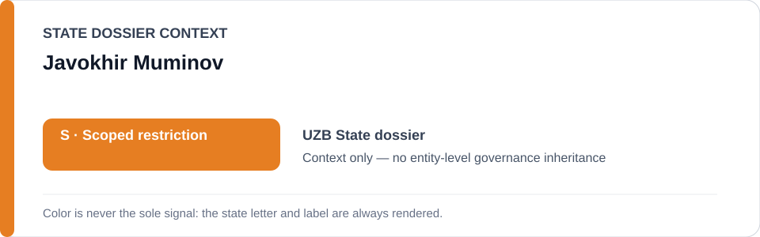
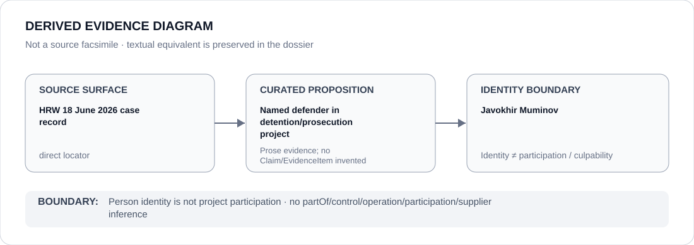

# Javokhir Muminov

> **Canonical per-entity evidence/provenance record.** This dossier has no licensing effect by itself and carries no standalone `provisional_outcome`.

## Identity scope

Javokhir Muminov, represented solely as the human-rights defender named in the June 2026 arrest, pre-trial detention and extortion-investigation project beginning in Karshi on 5 June 2026. Identity does not encode culpability or participation in the coercive project.

## State governance context

The canonical `UZB` State dossier records **S — Scoped restriction** for specified political, detention, discriminatory, eviction and agricultural-coercion projects. That `S` is context only and is not inherited by Javokhir Muminov.

## Evidence record

- Human Rights Watch's 18 June 2026 case report is the direct locator for Muminov's arrest/detention/prosecution record.
- The Schedule freeze defines the exact **Javokhir Muminov June 2026 detention/prosecution project**, including materially participating custody/prosecution functions while the proceeding remains active and the canonical retaliation/ill-treatment concerns remain unremediated.
- Uzbek police/prosecutors or criminal justice generally, independent investigation, effective remediation and unrelated dossier scopes are excluded.

## Attribution and exclusions

Being the defender subjected to arrest/detention/prosecution does not make Muminov an operator, participant, controller or culpable actor for the project. Institutional responsibility must be separately evidenced.

## Visual evidence

The diagram links the direct HRW case record to the bounded subject-of-case proposition and terminates at the person-identity boundary.

## Evidence gaps

This dossier does not adjudicate the extortion allegation, reconstruct every custody event or assign individual responsibility for alleged retaliation or ill-treatment absent separate structured evidence.

## Sources

- [Human Rights Watch — Uzbekistan activist held in trumped-up case](https://www.hrw.org/news/2026/06/18/uzbekistan-activist-held-in-trumped-up-case)
- [UZB named-case Schedule freeze](../../registry/schedule-state-s-freezes/batch-19b-uzb-freeze.yml)
- [Canonical Uzbekistan State dossier](../states/UZB.md)

## Governance boundary

A human-rights defender named as the subject of detention/prosecution does not inherit State governance, project responsibility, participation, culpability or Material Participation. The orange `S` is State context only.
