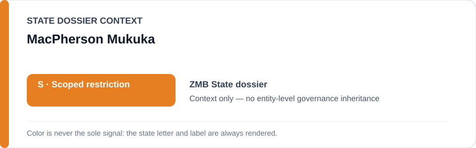
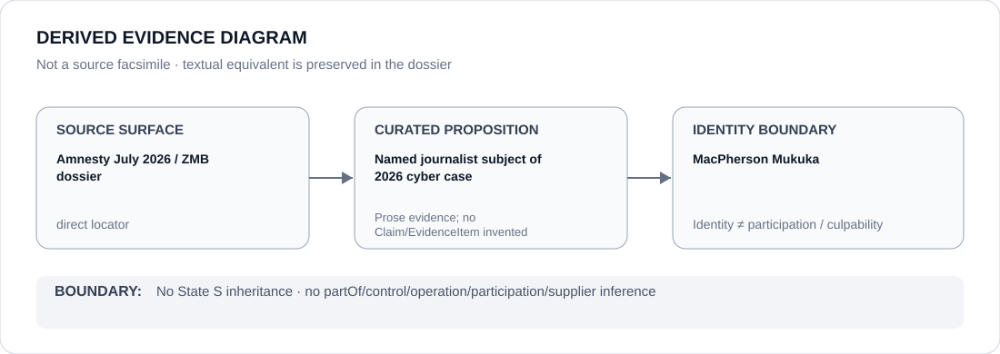

# MacPherson Mukuka

> **Canonical per-entity evidence/provenance record.** This dossier has no licensing effect by itself and carries no standalone `provisional_outcome`.

## Identity scope

Journalist MacPherson Mukuka, represented solely as the named subject of a July 2026 Cyber Crimes Act enforcement matter preserved in the Zambia dossier and Schedule-preparation freeze. Identity as the subject of a coercive project is not a culpability or governance finding about the person.

## State governance context

The canonical `ZMB` State dossier records **S — Scoped restriction** for project-specific coercive cyber/State-security and political-detention activity. That State status is **context only** and is not inherited by MacPherson Mukuka.

## Evidence record

- The Zambia dossier records that in July 2026 journalist MacPherson Mukuka was detained and charged under the 2025 Cyber Crimes Act over publication of a recording, raising concerns about intimidation of public-interest journalism.
- `batch-02-statutory-agency.yml` preserves the MacPherson Mukuka matter as an exact candidate project only to the extent supported by the canonical dossier and only where the specific use independently satisfies ECL §5.6.
- Amnesty International's July 2026 reporting is the direct current conduct source retained by the State dossier.

## Attribution and exclusions

Being the journalist targeted by a criminal-enforcement project does not make Mukuka a participant in, controller of or culpable actor for that project. This dossier creates no adverse finding, relation edge or standalone `S` status for the person.

## Visual evidence

The diagram records Mukuka only as the named journalist subject of the 2026 cyber case and stops at the person-identity boundary.

## Evidence gaps

This dossier does not adjudicate the underlying charge, reproduce the entire case record or identify every participating police/prosecution actor. Those facts require separate proposition-specific evidence.

## Sources

- [Amnesty International — Zambia authorities must free journalist arrested over social media posts](https://www.amnesty.org/en/latest/news/2026/07/zambia-authorities-must-free-journalist-arrested-over-social-media-posts/)
- [Canonical Zambia State dossier](../states/ZMB.md)
- [Statutory-agency Schedule freeze](../../registry/schedule-state-s-freezes/batch-02-statutory-agency.yml)

## Governance boundary

A person named as the subject of a coercive project does not inherit State governance, project responsibility, participation, culpability or Material Participation. The orange `S` is State context only.
