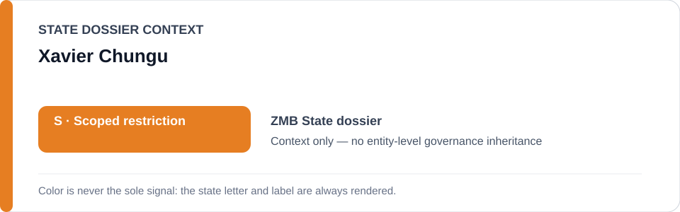
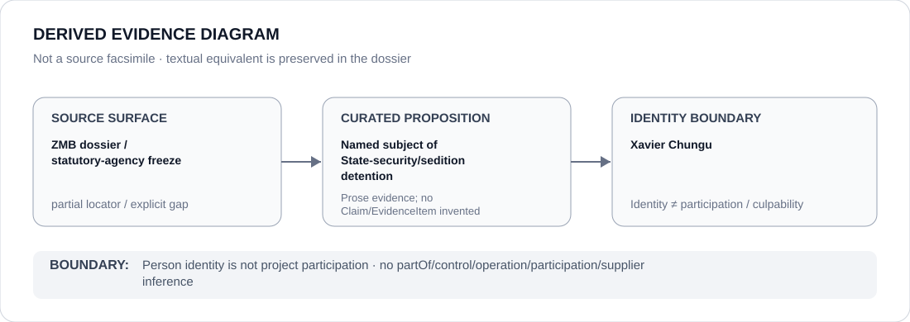

# Xavier Chungu

> **Canonical per-entity evidence/provenance record.** This dossier has no licensing effect by itself and carries no standalone `provisional_outcome`.

## Identity scope

Xavier Chungu, represented solely as the opposition figure named as the subject of the 2026 State-security/sedition detention matter after protected political expression. Identity does not encode culpability or participation in the enforcement project.

## State governance context

The canonical `ZMB` State dossier records **S — Scoped restriction** for cyber/State-security enforcement and detention projects materially criminalising protected journalism or peaceful political expression. That `S` is context only and is not inherited by Xavier Chungu.

## Evidence record

- The Zambia State dossier explicitly records that Xavier Chungu was detained after a podcast interview on State-security and sedition charges and denied bail through a `No Bail Certificate`.
- The statutory-agency freeze retains the **State-security/sedition detention of Xavier Chungu following protected political expression** as a candidate project only to the extent that the exact use independently satisfies ECL criteria.
- Courts, constitutional litigation, unrelated public-order functions and State-security enforcement generally are excluded.

## Attribution and exclusions

Being the opposition figure subjected to detention does not make Chungu a participant in, controller of or culpable actor for the State-security/sedition enforcement project. Any police or other institutional relation must be separately evidenced.

## Visual evidence

The diagram records only the named subject-of-case proposition and terminates at the person-identity boundary.

## Evidence gaps

The State dossier names Chungu directly, but the current freeze `identity_sources` preserve statutory and Zambia Police identity context rather than a person-specific Chungu case URL. Source granularity is therefore marked **partial**, and no missing locator is reconstructed by inference.

## Sources

- [Canonical Zambia State dossier](../states/ZMB.md)
- [ZMB statutory/agency Schedule freeze](../../registry/schedule-state-s-freezes/batch-02-statutory-agency.yml)
- [Human Rights Watch — World Report 2026: Zambia](https://www.hrw.org/world-report/2026/country-chapters/zambia)

## Governance boundary

An opposition figure named as the subject of detention does not inherit State governance, project responsibility, participation, culpability or Material Participation. The orange `S` is State context only.
