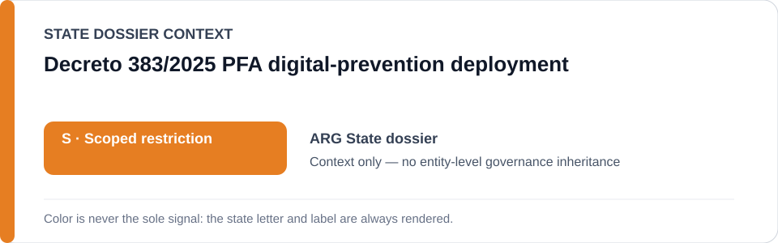
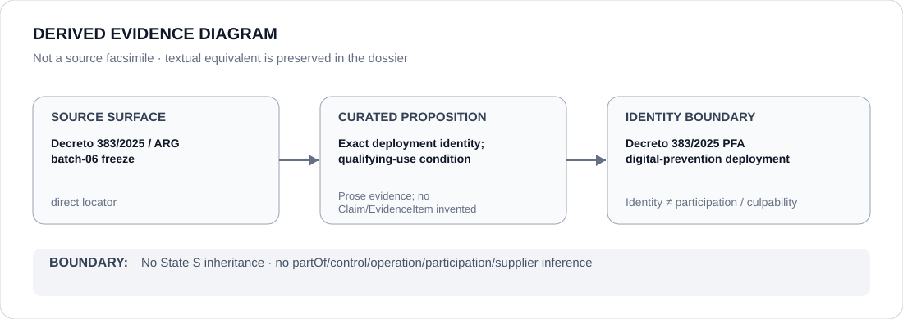

# Decreto 383/2025 PFA digital-prevention deployment

> **Canonical per-entity evidence/provenance record.** This dossier has no licensing effect by itself and carries no standalone `provisional_outcome`.

## Identity scope

The project identity covers the Decreto 383/2025 PFA prevention activity in open digital spaces, associated information-system/database use and identity-establishment detention described by the Argentina statutory-case freeze. It is an exact statutory/deployment boundary, not a synonym for all PFA digital work.

## State governance context

The canonical `ARG` State dossier records **S — Scoped restriction** for qualifying federal coercive policing and surveillance projects. State `S` is **context only** and is not automatically inherited by this project merely because the legal authority exists.

## Evidence record

- `batch-06-statutory-cases.yml` freezes this project only when the named powers are materially deployed for **coercive political monitoring, arbitrary detention or suppression of protected peaceful activity**.
- The official Decreto 383/2025 legal text is an identity/statutory locator for the powers and deployment surface.
- The Argentina dossier supplies the broader governance proposition that current federal coercive policing/surveillance projects can satisfy the scoped State determination when persistence and attribution are established.

## Attribution and exclusions

Judicially authorized criminal investigation, ordinary crime-prevention use not independently satisfying ECL §5, open-source intelligence, identity verification generally, independent courts/prosecutors and unrelated federal/provincial functions are excluded.

## Visual evidence

The diagram treats the statutory text as a direct project locator while preserving the separate qualifying-use condition.

## Evidence gaps

The decree identifies powers and project surface; it does not by itself prove a prohibited implementation in every deployment. Individual deployments still require evidence of materially qualifying use and attribution.

## Sources

- [Decreto 383/2025 — official Argentine legal text](https://www.argentina.gob.ar/normativa/nacional/decreto-383-2025-414065/texto)
- [Canonical Argentina State dossier](../states/ARG.md)
- [Statutory-case Schedule freeze](../../registry/schedule-state-s-freezes/batch-06-statutory-cases.yml)

## Governance boundary

Statutory authorization and project identity are not proof of prohibited conduct. Only materially evidenced qualifying use can enter the frozen scope; no generic PFA or Argentina governance is inferred. The orange `S` is State context only.
