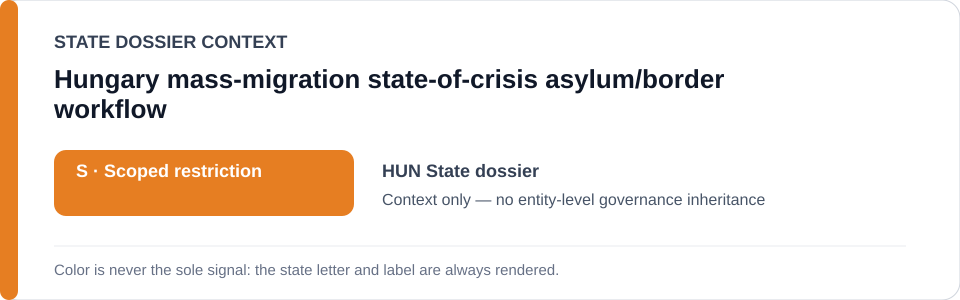
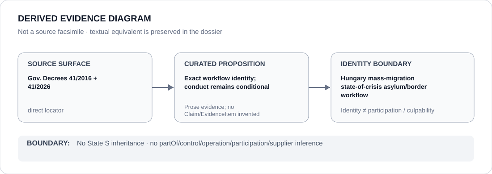

# Hungary mass-migration state-of-crisis asylum/border workflow

> **Canonical per-entity evidence/provenance record.** This dossier has no licensing effect by itself and carries no standalone `provisional_outcome`.

## Identity scope

The mass-migration state-of-crisis asylum/border workflow under Government Decree 41/2016 (III. 9), as extended by Government Decree 41/2026 (III. 5). The project identity is narrower than Hungarian asylum, immigration, border administration or policing generally.

## State governance context

The canonical `HUN` State dossier currently records **S — Scoped restriction** after removing the prior Pride/civic-space component. The remaining State scope concerns currently operative asylum/border systems materially denying individualized protection or contestability. That status is **context only** and is not automatically inherited by this project identity.

## Evidence record

- The identified-project freeze gives this workflow an exact legal-basis identity through Government Decrees 41/2016 and 41/2026 and records the current extension through 7 September 2026, subject to earlier amendment or termination.
- Its capacity limit is explicitly conditional: qualifying asylum-access/pushback implementation only where individualized protection/non-refoulement review is materially bypassed and ECL §5.6 is independently satisfied.
- The Hungary State dossier preserves the same legal/administrative locators while stating that they identify the workflow and relevant administration but do **not** by themselves establish prohibited implementation.

## Attribution and exclusions

Project identity and legal existence are not equivalent to an ECL finding for every implementation. Ordinary asylum processing and reception/support, temporary-protection support, courts, legal remedies and qualifying Independent Remediation Activity are excluded. Other border/public-order projects remain outside this freeze.

## Visual evidence

The diagram deliberately distinguishes a directly identified workflow from the still-conditional conduct proposition. It does not infer actor participation from the project name.

## Evidence gaps

The direct legal locators establish project identity and extension, not every factual implementation effect. The State dossier preserves an open historical locator gap for current pushback effects and related factual propositions; this dossier does not manufacture a stronger evidence grade from the legal basis alone.

## Sources

- [Government Decree 41/2016 (III. 9)](https://njt.jog.gov.hu/jogszabaly/2016-41-20-22)
- [Government Decree 41/2026 (III. 5)](https://njt.jog.gov.hu/jogszabaly/2026-41-20-22)
- [National Directorate-General for Aliens Policing — general information](https://oif.gov.hu/index.php/general-information)
- [Canonical Hungary State dossier](../states/HUN.md)
- [Identified-project Schedule freeze](../../registry/schedule-state-s-freezes/batch-07-identified-projects.yml)

## Governance boundary

A directly identifiable legal workflow does not inherit State governance and does not establish prohibited implementation, actor participation, culpability or Material Participation without the separately required evidence.
