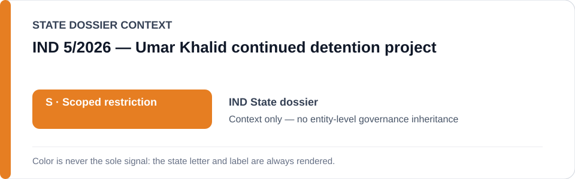
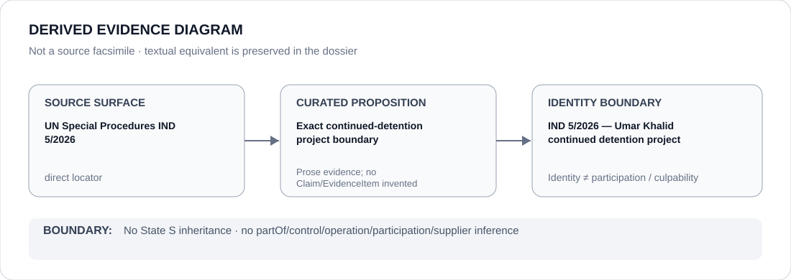

# IND 5/2026 — Umar Khalid continued detention project

> **Canonical per-entity evidence/provenance record.** This dossier has no licensing effect by itself and carries no standalone `provisional_outcome`.

## Identity scope

The exact named-case continued-detention project bounded by UN Special Procedures communication `IND 5/2026`. The project identity is narrower than UAPA enforcement, Indian counterterrorism enforcement, Indian custody/prosecution generally or any other detainee/case.

## State governance context

The canonical `IND` State dossier currently records **S — Scoped restriction**. That State status is context only; the project is separately bounded by its own evidence and Schedule-freeze provenance.

## Evidence record

- UN Special Procedures `IND 5/2026` is the direct identity/evidence locator retained by the India dossier.
- `batch-10a-ind-freeze.yml` defines the project boundary as the continued detention and materially participating prosecution/custody processes concerning Umar Khalid identified by that communication.
- The freeze is `renderable-subset` / `ready-named-case-project`, but remains `operative: false`; it does not itself make this dossier a license restriction.

## Attribution and exclusions

Project identity does not establish which agency, office or person materially participates. The freeze expressly excludes UAPA/counterterrorism enforcement generally, courts/remedial activity generally and other cases. Actor participation remains a separately evidenced question.

## Visual evidence

The diagram preserves the exact source-to-project boundary without turning project adjacency into actor participation.

## Evidence gaps

This dossier does not enumerate every prosecution/custody actor, create new Material Participation findings, or extend the case beyond the continuing factual and legal boundary preserved by the freeze.

## Sources

- [UN Special Procedures — IND 5/2026](https://spcommreports.ohchr.org/TmSearch/RelCom?code=IND+5%2F2026)
- [Canonical India State dossier](../states/IND.md)
- [IND named-case Schedule freeze](../../registry/schedule-state-s-freezes/batch-10a-ind-freeze.yml)

## Governance boundary

Project identity, even when Schedule-ready, does not create actor participation, command, supply, culpability or Material Participation. The orange `S` remains State context; operative licensing effect requires the versioned Schedule/release mechanism.
