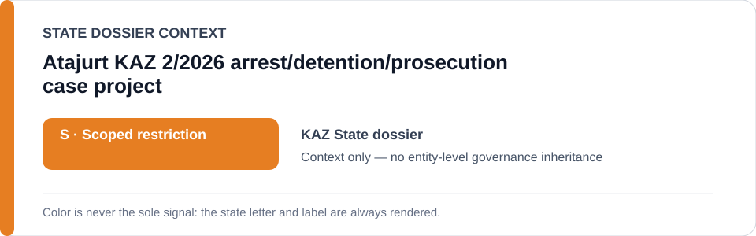
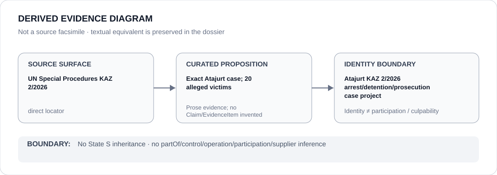

# Atajurt KAZ 2/2026 arrest/detention/prosecution case project

> **Canonical per-entity evidence/provenance record.** This dossier has no licensing effect by itself and carries no standalone `provisional_outcome`.

## Identity scope

The exact Atajurt movement arrest/detention/prosecution matter identified by UN Special Procedures communication `KAZ 2/2026`, limited by the Schedule-preparation freeze to the 20 alleged victims and materially participating authorities/functions in that exact matter.

## State governance context

The canonical `KAZ` State dossier currently records **S — Scoped restriction** for defined political-security, prosecution, media, professional-retaliation and discriminatory-religious projects. The directly frozen Atajurt project is only one part of that broader governance record. State `S` is **context only** and is not inherited merely from project identity.

## Evidence record

- UN Special Procedures communication `KAZ 2/2026` concerns the arrest, detention and criminal prosecution of 20 Atajurt movement activists and raises freedom-of-assembly, association and expression concerns in the curated State record.
- `batch-07-identified-projects.yml` freezes only that exact matter where protected peaceful assembly, association or expression is materially criminalized.
- The freeze expressly rejects a generic Kazakhstan security/prosecution class; separate `KAZ 1/2026` and `KAZ 3/2026` media/legal-representation and religious-enforcement propositions remain outside this renderable project boundary.

## Attribution and exclusions

Project identity does not identify every materially participating authority or function. The Constitutional Court and rights-protective judicial/remedial functions, unrelated criminal/security enforcement and other media/religious/professional-sanction projects are excluded from this freeze absent separate evidence.

## Visual evidence

The diagram represents the exact case boundary and 20-alleged-victim scope without converting the case into a generic security or prosecution restriction.

## Evidence gaps

This dossier does not enumerate the 20 individuals, encode each alleged event as a structured Claim/EvidenceItem, or identify every participating authority. Those questions require separate evidence rather than inference from the State dossier or project label.

## Sources

- [UN Special Procedures — KAZ 2/2026](https://spcommreports.ohchr.org/TmSearch/RelCom?code=KAZ+2%2F2026)
- [Canonical Kazakhstan State dossier](../states/KAZ.md)
- [Identified-project Schedule freeze](../../registry/schedule-state-s-freezes/batch-07-identified-projects.yml)

## Governance boundary

A frozen named-case project does not create a generic Kazakhstan security/prosecution class, does not identify actor participation by itself and does not transfer State governance, culpability or Material Participation to adjacent entities.
