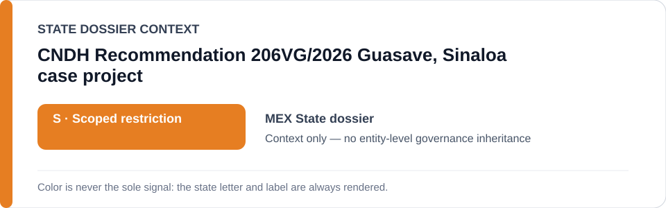
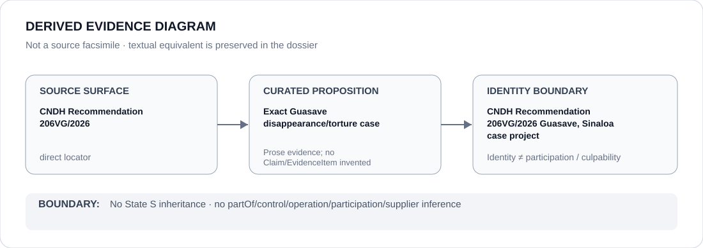

# CNDH Recommendation 206VG/2026 Guasave, Sinaloa case project

> **Canonical per-entity evidence/provenance record.** This dossier has no licensing effect by itself and carries no standalone `provisional_outcome`.

## Identity scope

The exact Guasave, Sinaloa grave-violation case documented by CNDH Recommendation `206VG/2026` and separately frozen in the Schedule-preparation registry. The project identity is narrower than SEMAR, Mexico's armed forces, public-security activity, disappearance/torture cases generally or biometric/data infrastructure.

## State governance context

The canonical `MEX` State dossier currently records **S — Scoped restriction** for project-specifically attributable coercive conduct. That State status is **context only**; this project is bounded by Recommendation `206VG/2026` and the narrower freeze rather than by generic State adjacency.

## Evidence record

- The Mexico dossier retains CNDH Recommendation `206VG/2026` as an authoritative direct locator and summarizes it as attributing forced disappearance, torture and deprivation of life to Navy personnel in Guasave, Sinaloa.
- The identified-project freeze limits the renderable project to the conduct and materially participating Secretaría de Marina elements identified by that recommendation.
- The freeze expressly excludes CNDH and victim/search/remediation functions, ordinary naval/public-security activity and all other disappearance/torture or biometric/data projects pending separate project freezes.

## Attribution and exclusions

The project does not create a generic SEMAR or armed-forces class. CNDH is evidence/remedial provenance, not a participant in the conduct it documents. Actor participation must follow the recommendation's project-specific attribution or separate evidence rather than entity adjacency.

## Visual evidence

The diagram preserves the authoritative recommendation → exact Guasave case boundary without broadening the case into an agency, armed-forces or security-sector restriction.

## Evidence gaps

This dossier does not reproduce the complete recommendation, enumerate each victim or SEMAR element, or convert all underlying findings into structured Claims/EvidenceItems. It also does not extend the project beyond the exact case frozen by the registry.

## Sources

- [CNDH Recommendation 206VG/2026](https://hist.cndh.org.mx/index.php/documento/recomendacion-206vg2026)
- [Canonical Mexico State dossier](../states/MEX.md)
- [Identified-project Schedule freeze](../../registry/schedule-state-s-freezes/batch-07-identified-projects.yml)

## Governance boundary

A directly evidenced case project does not create generic agency participation, command, supply, culpability or Material Participation, and State `S` does not propagate beyond the project's separately supported boundary.
