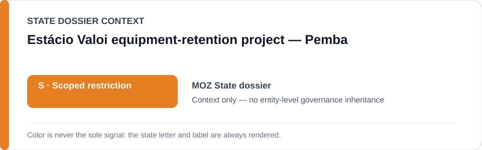
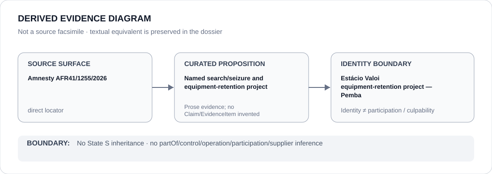

# Estácio Valoi equipment-retention project — Pemba

> **Canonical per-entity evidence/provenance record.** This dossier has no licensing effect by itself and carries no standalone `provisional_outcome`.

## Identity scope

The exact 16 June 2026 Pemba search/seizure and continued equipment-retention process concerning investigative journalist Estácio Valoi, as bounded in `batch-11c-moz-freeze.yml`. This identity does not denote SERNIC, Mozambican policing or journalist-related enforcement generally.

## State governance context

The canonical `MOZ` State dossier currently records **S — Scoped restriction**. That State status is context only; this named project has its own narrower freeze boundary.

## Evidence record

- Amnesty International document `AFR 41/1255/2026` is the direct identity/evidence source preserved by the Schedule freeze.
- The freeze bounds the project to the search/seizure and continued retention of Valoi's work equipment by Mozambique's National Criminal Investigation Service in Pemba.
- Its capacity limit lasts only while the equipment remains retained without an independently demonstrated lawful, necessary and proportionate basis; return or independent judicial validation/remedy is an explicit boundary condition.

## Attribution and exclusions

The project's existence does not create a generic SERNIC restriction. The freeze expressly excludes SERNIC or Mozambican policing generally, independent investigation/remediation and the project after its defined termination conditions. Participation by any actor must remain separately evidenced.

## Visual evidence

The diagram preserves the exact source-to-project proposition and prevents the named case from widening into a service-wide attribution.

## Evidence gaps

This dossier does not independently establish post-cutoff equipment status, identify every participating official, or encode new Claims/EvidenceItems beyond the canonical State dossier and freeze.

## Sources

- [Amnesty International — AFR 41/1255/2026](https://www.amnesty.org/en/documents/afr41/1255/2026/en/)
- [Canonical Mozambique State dossier](../states/MOZ.md)
- [Mozambique named-project Schedule freeze](../../registry/schedule-state-s-freezes/batch-11c-moz-freeze.yml)

## Governance boundary

A bounded project identity does not create service-wide governance, actor participation, command, supply, culpability or Material Participation. The orange `S` is State context; operative licensing effect remains release/Schedule controlled.
