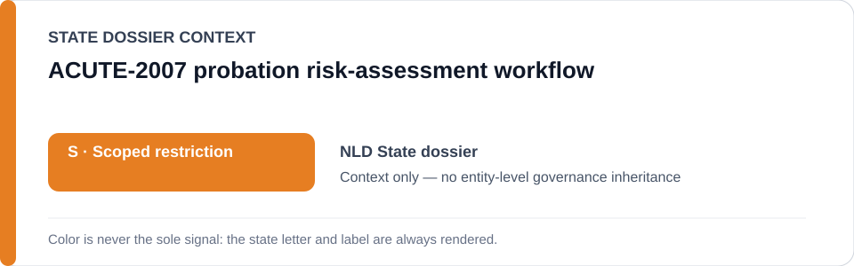
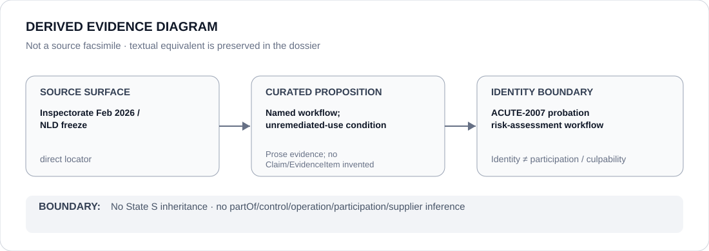

# ACUTE-2007 probation risk-assessment workflow

> **Canonical per-entity evidence/provenance record.** This dossier has no licensing effect by itself and carries no standalone `provisional_outcome`.

## Identity scope

The `ACUTE-2007` probation risk-assessment workflow, one of the three exact named tools retained in the current Netherlands Schedule boundary. Project identity does not encode score, outcome, operator relation or current remediation status.

## State governance context

The canonical `NLD` State dossier records **S — Scoped restriction** for `STATIC-99R`, `STABLE-2007` and `ACUTE-2007` while the February 2026 Inspectorate finding remains unremediated. State `S` is **context only**; this project remains separately bounded by its named-tool evidence and deployment/remediation condition.

## Evidence record

- On 12 February 2026 the Justice and Security Inspectorate found that Dutch probation organizations did not use `STATIC-99R`, `STABLE-2007` and `ACUTE-2007` in a demonstrably responsible manner.
- `status-resolved-nld.yml` freezes only those three workflows while that finding remains unremediated and only where data-driven risk assessment materially influences criminal-justice recommendations without adequate validation, safeguards or contestability.
- OXREC is separately excluded while suspended, showing that current deployment and remediation status are part of the governance boundary rather than immutable properties of an algorithm identity.

## Attribution and exclusions

This dossier does not identify a specific operator for `ACUTE-2007`, infer individual scoring outcomes or attribute every probation recommendation to the workflow. Corrected or independently validated systems, courts exercising independent judgment and oversight/remediation are excluded from the current freeze.

## Visual evidence

The diagram preserves the exact named-workflow boundary and the unremediated-use condition without inventing an operator edge.

## Evidence gaps

The repository does not yet contain a complete current organization-by-organization deployment or remediation map for `ACUTE-2007`. Specific operator relations and individual scoring events therefore remain unresolved.

## Sources

- [Justice and Security Inspectorate — risky algorithm use by probation services](https://www.inspectie-jenv.nl/actueel/nieuws/2026/02/12/risicovol-algoritmegebruik-door-reclassering)
- [Inspectorate report](https://www.inspectie-jenv.nl/documenten/2026/02/12/rapport-risicovol-algoritmegebruik)
- [Canonical Netherlands State dossier](../states/NLD.md)
- [NLD status-resolved Schedule freeze](../../registry/schedule-state-s-freezes/status-resolved-nld.yml)

## Governance boundary

A named risk-assessment workflow does not establish its operator, individual scoring outcomes, culpability or Material Participation. State `S` is context only and does not propagate beyond separately supported project facts.
