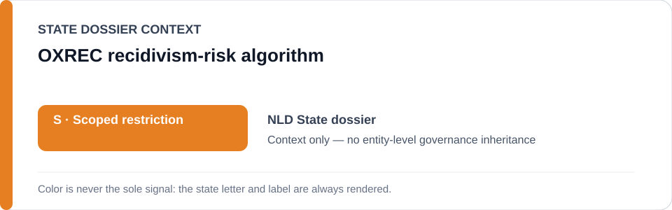
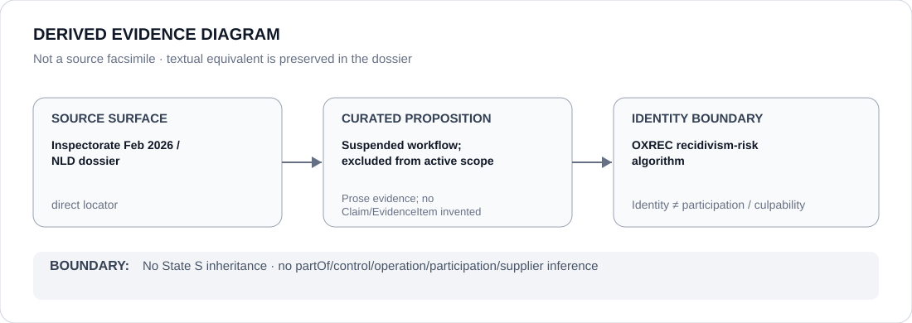

# OXREC recidivism-risk algorithm

> **Canonical per-entity evidence/provenance record.** This dossier has no licensing effect by itself and carries no standalone `provisional_outcome`.

## Identity scope

The OXREC recidivism-risk algorithm tracked in the Netherlands probation-tool record. OXREC remains a canonical project identity because its evidentiary and remediation history matters, even though the current State dossier **excludes it from active `S` scope while its announced suspension remains effective**.

## State governance context

The canonical `NLD` State dossier currently records **S — Scoped restriction**, but only for `STATIC-99R`, `STABLE-2007` and `ACUTE-2007` while their February 2026 validation finding remains unremediated. OXREC is expressly outside that active scope while suspended. The orange `S` below is therefore **State context only**, not an OXREC outcome.

## Evidence record

- The February 2026 Inspectorate investigation found serious defects in OXREC alongside the three other named probation risk tools.
- The probation organizations announced a temporary stop of OXREC; the canonical State dossier credits that suspension as **material remediation**.
- `status-resolved-nld.yml` consequently excludes OXREC while suspended and states that it may re-enter consideration only if reactivated without adequate correction and validation.

## Attribution and exclusions

Historical inclusion in an adverse algorithmic-risk record does not make OXREC permanently restricted. This dossier does not infer current deployment, a current operator relation or a current qualifying use. State `S` and the active three-tool freeze must not be propagated back onto this suspended project.

## Visual evidence

The diagram deliberately records a negative governance proposition: **suspended workflow; excluded from active scope**. Retaining the identity preserves remediation history without reactivating a restriction.

## Evidence gaps

The repository does not independently establish whether OXREC has been reactivated after the evidence cutoff, whether any corrected version has been independently validated, or which organization would operate a future deployment. Any re-entry into scope requires new current evidence.

## Sources

- [Justice and Security Inspectorate — risky algorithm use by probation services](https://www.inspectie-jenv.nl/actueel/nieuws/2026/02/12/risicovol-algoritmegebruik-door-reclassering)
- [Inspectorate report](https://www.inspectie-jenv.nl/documenten/2026/02/12/rapport-risicovol-algoritmegebruik)
- [Canonical Netherlands State dossier](../states/NLD.md)
- [NLD status-resolved Schedule freeze](../../registry/schedule-state-s-freezes/status-resolved-nld.yml)

## Governance boundary

Entity persistence is not governance persistence. OXREC's historical evidence remains auditable while suspension keeps it outside active scope; State `S`, operation, culpability and Material Participation are not inherited.
