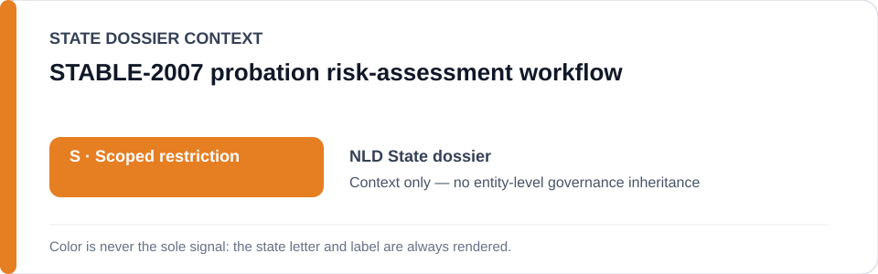
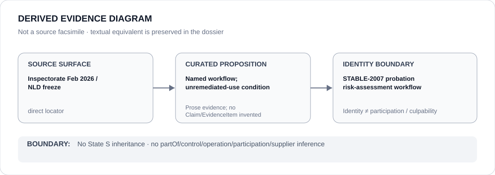

# STABLE-2007 probation risk-assessment workflow

> **Canonical per-entity evidence/provenance record.** This dossier has no licensing effect by itself and carries no standalone `provisional_outcome`.

## Identity scope

The `STABLE-2007` probation risk-assessment workflow, one of the three exact named tools in the current Netherlands Schedule boundary. Its identity does not encode score, outcome, operator relation or current remediation status.

## State governance context

The canonical `NLD` State dossier records **S — Scoped restriction** for `STATIC-99R`, `STABLE-2007` and `ACUTE-2007` while the February 2026 Inspectorate finding remains unremediated. State `S` is **context only**; the named workflow remains separately bounded by evidence and remediation status.

## Evidence record

- The Inspectorate's 12 February 2026 investigation found non-demonstrably-responsible use of `STATIC-99R`, `STABLE-2007` and `ACUTE-2007` by Dutch probation organizations.
- The status-resolved freeze retains `STABLE-2007` only while that finding remains unremediated and only where data-driven risk assessment materially influences criminal-justice recommendations without adequate validation, safeguards or contestability.
- OXREC's explicit suspension-based exclusion confirms that current deployment/remediation state is part of the boundary rather than an immutable property of an algorithm identity.

## Attribution and exclusions

This dossier does not identify a specific operator for `STABLE-2007`, infer individual scoring outcomes or attribute every probation recommendation to the workflow. Corrected/validated systems, independent judicial decisions and oversight/remediation are excluded.

## Visual evidence

The diagram preserves the exact named-tool boundary and the unremediated-use condition without inventing an operator edge.

## Evidence gaps

A current organization-by-organization deployment/remediation map is not encoded in the repository. Specific operator relations and scoring events therefore remain unresolved.

## Sources

- [Justice and Security Inspectorate — risky algorithm use by probation services](https://www.inspectie-jenv.nl/actueel/nieuws/2026/02/12/risicovol-algoritmegebruik-door-reclassering)
- [Inspectorate report](https://www.inspectie-jenv.nl/documenten/2026/02/12/rapport-risicovol-algoritmegebruik)
- [Canonical Netherlands State dossier](../states/NLD.md)
- [NLD status-resolved Schedule freeze](../../registry/schedule-state-s-freezes/status-resolved-nld.yml)

## Governance boundary

A named workflow does not establish its operator, individual scores, culpability or Material Participation. State `S` is context only and does not propagate beyond supported project facts.
