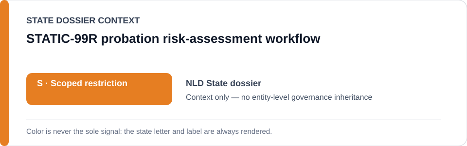
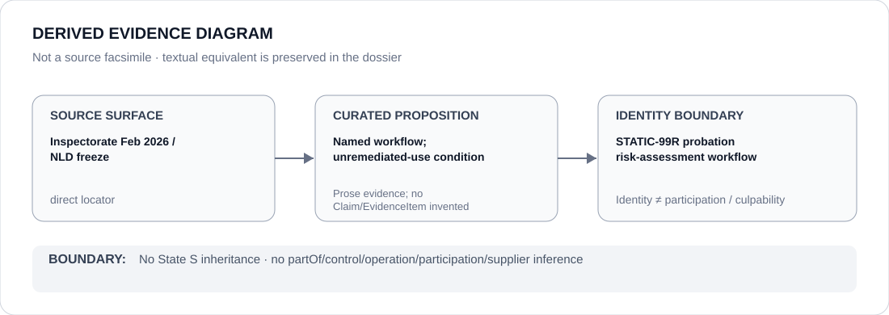

# STATIC-99R probation risk-assessment workflow

> **Canonical per-entity evidence/provenance record.** This dossier has no licensing effect by itself and carries no standalone `provisional_outcome`.

## Identity scope

The `STATIC-99R` probation risk-assessment workflow, one of the three exact named tools in the current Netherlands Schedule boundary. Project identity does not encode score, outcome, operator relation or present remediation status.

## State governance context

The canonical `NLD` State dossier records **S — Scoped restriction**, presently limited to `STATIC-99R`, `STABLE-2007` and `ACUTE-2007` while the Inspectorate's February 2026 finding of non-demonstrably-responsible use remains unremediated. State `S` is **context only**; this project is separately bounded by its named-tool evidence.

## Evidence record

- The Justice and Security Inspectorate found on 12 February 2026 that Dutch probation organizations did not use `STATIC-99R`, `STABLE-2007` and `ACUTE-2007` in a demonstrably responsible manner.
- `status-resolved-nld.yml` freezes only those three named workflows while that finding remains unremediated and limits capacity to data-driven risk assessment materially influencing criminal-justice recommendations without adequate validation, safeguards or contestability.
- OXREC is explicitly excluded while suspended, demonstrating that a named algorithm can leave the active scope when remediation changes its deployment state.

## Attribution and exclusions

The project identity does not establish which probation organization operates `STATIC-99R`, which individual receives a score, or how a particular recommendation is made. Corrected/independently validated systems, courts exercising independent judgment and oversight/remediation are excluded from the current freeze.

## Visual evidence

The diagram represents the exact named workflow and the current validation/remediation condition while preserving operator attribution as a separate evidence question.

## Evidence gaps

The repository does not yet provide a complete current operator map, deployment inventory or remediation record for `STATIC-99R` by organization. No operator relation or individual scoring event is inferred.

## Sources

- [Justice and Security Inspectorate — risky algorithm use by probation services](https://www.inspectie-jenv.nl/actueel/nieuws/2026/02/12/risicovol-algoritmegebruik-door-reclassering)
- [Inspectorate report](https://www.inspectie-jenv.nl/documenten/2026/02/12/rapport-risicovol-algoritmegebruik)
- [Canonical Netherlands State dossier](../states/NLD.md)
- [NLD status-resolved Schedule freeze](../../registry/schedule-state-s-freezes/status-resolved-nld.yml)

## Governance boundary

A named risk-assessment workflow does not establish its operator, individual scoring outcomes, culpability or Material Participation. State `S` does not propagate beyond the separately supported project boundary.
