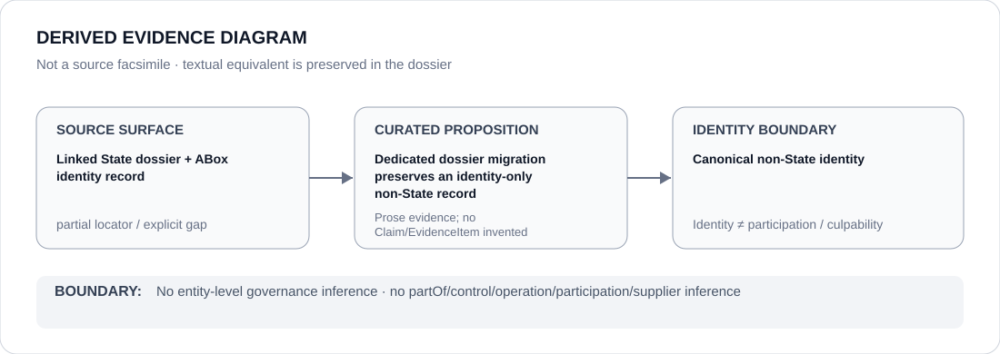

# Bangkok Criminal Court black case Aor.498/2567 project

## Identity scope
Canonical identity `PROJECT-THA-AOR-498-2567`; ABox metadata remains authoritative.

## State governance context
`THA` context is `S` only; no entity-level governance inheritance.

## Evidence record
Dedicated dossier migration only; no Claim, EvidenceItem, relation, participation or licensing effect is created.

## Attribution and exclusions
Identity or adjacency does not infer partOf, sameAs, control, operation, participation, supply, command, membership or culpability.

## Visual evidence

## Evidence gaps
Source granularity: `partial`; proposition-specific gaps remain open.

## Sources
- `knowledge/entities/PROJECT-THA-AOR-498-2567.json`
- `dossiers/states/THA.md`

## Governance boundary
This dossier records identity and context only; it does not independently establish an ECL restriction.
