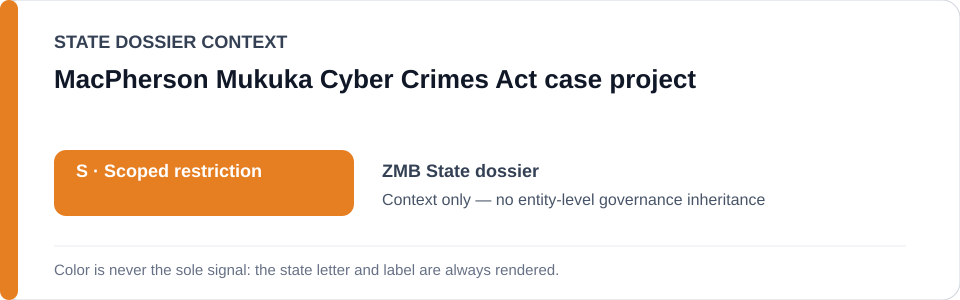
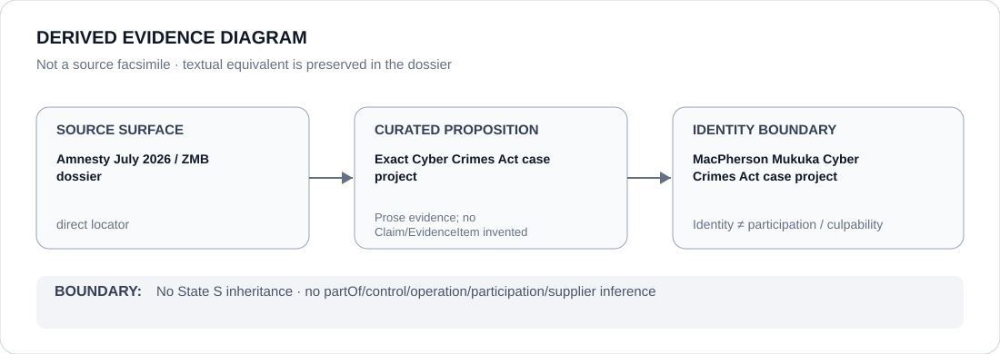

# MacPherson Mukuka Cyber Crimes Act case project

> **Canonical per-entity evidence/provenance record.** This dossier has no licensing effect by itself and carries no standalone `provisional_outcome`.

## Identity scope

The exact 2026 Cyber Crimes Act enforcement matter concerning journalist MacPherson Mukuka, represented as a named-case project inside Zambia's broader cyber/state-security governance record. It is narrower than Cyber Crimes Act enforcement, cybercrime investigation or Zambia Police Service activity generally.

## State governance context

The canonical `ZMB` State dossier records **S — Scoped restriction** for project-specific coercive cyber/State-security and political-detention activity. The Schedule-preparation freeze makes only narrow case-specific subsets renderable. State `S` is **context only** and is not automatically inherited from project identity.

## Evidence record

- The Zambia dossier records Mukuka's July 2026 detention and Cyber Crimes Act charge over publication of a recording, based on current Amnesty International reporting.
- `batch-02-statutory-agency.yml` identifies Cyber Crimes Act No. 4 of 2025 enforcement against protected journalism/expression, including the Mukuka matter, as a candidate project only where the exact use independently satisfies ECL §5.6.
- The freeze's capacity limit is case-specific criminalisation or detention of protected journalism/political expression, not cybercrime or State-security enforcement generally.

## Attribution and exclusions

Project identity does not establish participation by every Zambia Police Service unit or every actor in the criminal process. Ordinary cybercrime investigation, unrelated public-order functions, courts and constitutional litigation are excluded; actor participation remains separately evidenced.

## Visual evidence

The diagram preserves the exact Cyber Crimes Act case boundary without widening it into a generic police or cybercrime project class.

## Evidence gaps

This dossier does not identify every participating unit/officer/prosecutor, reproduce the full charge file or create new Material Participation relations. It also does not freeze Zambia's residual surveillance/interception scope.

## Sources

- [Amnesty International — Zambia authorities must free journalist arrested over social media posts](https://www.amnesty.org/en/latest/news/2026/07/zambia-authorities-must-free-journalist-arrested-over-social-media-posts/)
- [Canonical Zambia State dossier](../states/ZMB.md)
- [Statutory-agency Schedule freeze](../../registry/schedule-state-s-freezes/batch-02-statutory-agency.yml)

## Governance boundary

A named case project does not create a generic police/cybercrime class, actor participation, command, culpability or Material Participation. The orange `S` is State context only.
